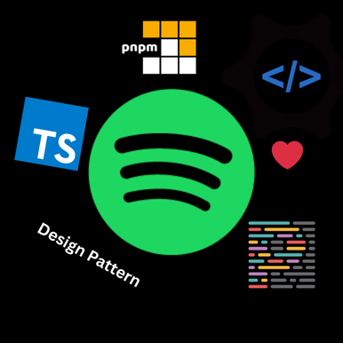

<div align='center'
<p align='center'>
<h1 align='center'>SONGEETA</h1></p>
</div>

Spotify Simulation, TypeScript project without a UI, designed for learning TypeScript, OOP, design patterns, and clean code.

## Things to do before committing code 
```bash
pnpm format
```

## Setup
```bash
pnpm install
pnpm dev
```